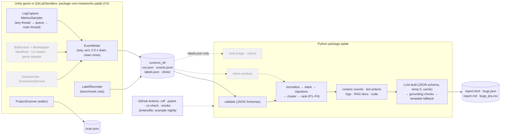

# Miaw QA Lab

[](https://github.com/sorinnha/miaw-qa-lab/actions/workflows/python-ci.yml)

AI-assisted game QA for Unity. A C# package records what happens during a playtest. A Python tool turns
thousands of log lines into a short list of unique, ranked bugs, with reports that cite their evidence.

> **Status:** in development, nothing released yet. Built: run recording (M1), triage with AI reports
> and RAG (M2–M3), the project scanner and game adapter contracts (M7). Next: the seeded bot,
> detectors and screenshots (M4), then measured results (M5–M6). See [Limitations](#8-limitations) and
> [docs/PLAN.md](docs/PLAN.md).

## 1. Problem

A one-hour playtest of a Unity game can print thousands of warnings and errors. Most are repeats of a
few real bugs, and the useful ones are buried. A QC tester then rewrites each one by hand into a
ticket: what happened, where, how to reproduce it, how bad it is. Studios automate parts of this with
autoplay bots, crash grouping and, more and more, language models. A model that invents reproduction
steps or priorities makes things worse. So the hard part is grouping well and staying honest about the
evidence.

## 2. Demo

<!-- Placeholder: a 30–60 s GIF of report.html from a sandbox run, recorded on Sora's PC (M7). -->
*Demo GIF: recorded on the PC in M7.*

## 3. What it does

- **Records playtests in Unity** (`unity/com.miawworks.qalab`). Add `-qalab` to a build, or tick
  auto-start in the editor, and every run writes a folder:
  - `run.json` (build, scenes, seed, clean end or crash);
  - `events.jsonl` (logs with stack traces, metrics every second, markers);
  - `labels.json` (seeded-bug ground truth) in benchmark mode.

  Logging is thread-safe: log callbacks from any thread only enqueue, and the main thread writes
  every 0.5 s.
- **Triages runs** (`qalab triage run`):
  - validates every line against the JSON Schemas;
  - normalizes messages (ids and numbers out) and parses stack frames;
  - groups by signature, ranks with an explainable score and computes priority P1–P4;
  - drafts each report with an LLM (Gemini or a local model through Ollama), adding RAG over design docs and code.

  Every step, piece of evidence and doc reference is checked against the run. Anything ungrounded is
  dropped or flagged for review, and a template report is the fallback. Outputs are `report.html`
  (offline, filterable), `bugs.json`, `report.md` and `bugs_jira.csv`.
- **Scans projects** (Tools → QA Lab → Scan Project, or `scripts\scan_project.ps1`):
  - missing scripts, broken references, empty material slots and error shaders in Build Settings
    scenes and prefabs;
  - writes `scan.json`; exit 1 on errors.
- **Plays games through their own commands** (from M4). Bot adapters (`IBotAdapter`) draw every random
  choice from a seeded RNG, so a seed gives the same random sequence. Game state and timing still vary
  between runs, so the action log, where every action becomes a "step to reproduce", is the repro
  record. A game adapter template ships as a package sample.
- **Measures itself.** A sandbox project has 16 seeded bugs with known causes, so clustering and
  detection can be scored against ground truth (M5–M6).

Guides: [USER_GUIDE.md](docs/USER_GUIDE.md) (QC testers) · [GAME_INTEGRATION.md](docs/GAME_INTEGRATION.md)
(adding it to a game) · [ARCHITECTURE.md](docs/ARCHITECTURE.md).

## 4. Architecture



Dashed boxes are planned (M4–M6). The Unity and Python sides share only the JSON Schemas in `schemas/`.
Both test against the same examples, so either side can change internally without breaking the other.

## 5. Quick start

```powershell
py -3.12 -m venv .venv ; .\.venv\Scripts\Activate.ps1 ; pip install -e ".\python[dev]"
qalab validate samples\sample_run
```

On Linux/macOS: `python3 -m venv .venv && . .venv/bin/activate && pip install -e "./python[dev]"`, then
the same commands with `/`.

**Offline, no model** (deterministic fake provider, the one the tests use):

```powershell
qalab triage run samples\sample_run --provider fake --docs docs\sandbox_design.md --out out\sample_report
start out\sample_report\report.html
```

**With Gemini** (hosted; send sandbox data only, see [Data handling](#10-data-handling)):

```powershell
pip install -e ".\python[dev,gemini]"
copy .env.example .env        # then put your key after GEMINI_API_KEY= in .env
qalab triage run samples\sample_run --provider gemini --docs docs\sandbox_design.md --out out\sample_report
```

> Two learning tasks still gate these commands (see [How it was built](#11-how-it-was-built)): every
> `triage run` needs `normalize_message`, and `--docs` with an embedding provider (fake, Ollama, Gemini)
> also needs `cosine_top_k` (`--provider none` uses TF-IDF instead). Until they're written, the run stops
> with `NotImplementedError: YOU WRITE`. `qalab validate` and the test suite (`pytest python -q`) already work.

Exit code 3 means a P1 bug was found, so CI can fail on it. Tunables (priority thresholds, crash
multiplier, clustering thresholds, model names) live in `qalab.toml`; the rank weights are fixed in
`triage/rank.py`. The engine-free C# is tested outside Unity with
`dotnet test tools/cs-check -c Release --filter "TestCategory!=YouWrite"`, and the Unity tests run with
`scripts\unity_tests.ps1 -Platform EditMode|PlayMode`.

## 6. Results

<!-- Placeholder: filled in M5/M6 from docs/EVAL_RESULTS.md. Every number comes from `qalab eval`. -->
*Not measured yet.* Clustering precision, recall and F1 per variant (E1), local vs hosted model (E2),
RAG on/off (E3), and visual detection (H1–H4) will be reported here from
[docs/EVAL_RESULTS.md](docs/EVAL_RESULTS.md). Each number will come with the command that reproduces it.

## 7. Design decisions

The full list, with alternatives and consequences, is in [docs/DECISIONS.md](docs/DECISIONS.md).

- **Contracts first** (D-001, D-007): `schemas/*.json` define run.json, events, labels and bug reports.
  Python validates raw JSON against them, and C# golden tests check their output against the same
  examples.
- **Priority is computed, severity is suggested** (D-004, D-012):
  - `score = weight × (1 + log2 count) × (1 + 0.5 × (runs − 1)) × crash factor`;
  - the LLM never sets priority, and a severity far from it is flagged.
- **Never trust the model's ids** (D-008, D-010):
  - JSON-schema output at temperature 0, pydantic validation, 2 retries, then the template;
  - evidence, action and doc ids are checked against the context; unknown ones are dropped and flagged;
  - a step that claims a bot action that doesn't exist becomes `inferred`.
- **Works without AI**: `--provider none` writes template reports, and retrieval falls back to TF-IDF
  (D-011).
- **Seeds are ground truth** (D-003, D-017, D-020, D-023):
  - seeded bugs record labels from engine state, and their ids never appear in log text;
  - triage never opens `labels.json` (a test enforces it);
  - catalog match rules are checked to be disjoint on real stacks.
- **Thread-safe, crash-tolerant logging** (D-022, D-023): log callbacks only enqueue. `seq` comes from
  `Interlocked`. The run ends with `run_end` as the last event and no seq gaps, and `ended_at` marks a
  clean end.
- **Engine-free C# is tested outside Unity** (D-006, D-018): `tools/cs-check` compiles it like Unity
  does (netstandard2.1, C# 9) and runs its tests on .NET 8 in CI.
- **Gemini is the configured provider, and providers stay pluggable** (D-002, D-021): the key comes from
  the environment only. A SQLite cache keyed by prompt hash makes reruns free.

## 8. Limitations

- **No measured results yet.** The seeded bot, detectors, screenshots (M4), triage evaluation (M5) and
  vision (M6) aren't built, so there are no precision, recall or detection numbers.
- **The Unity code hasn't run in Unity yet.**
  - It was written in cloud sessions without Unity. The engine-free part is compiled and tested in
    .NET, and the rest was only compiled against stand-in UnityEngine types.
  - The first real Unity compile, the tests and the 60-second acceptance run are on the PC checklist
    (`docs/progress/PC_CHECKLIST.md`).
- **Learning tasks gate the pipeline.** Several functions are written by hand as learning tasks;
  until they exist, their tests are expected failures and the end-to-end triage run stops early.
- **Grouping is signature-based.** It splits a bug whose message varies in ways normalization misses,
  and the TF-IDF/embedding variants can merge different bugs (E1 will measure both).
- **Scale.** Events are held in memory per run (D-014). There is no database or streaming for millions
  of events.
- **CI.** `ci/Jenkinsfile` is an example that hasn't run on a Jenkins server. Unity tests aren't in
  GitHub Actions (they need a Unity license).
- **Data.** Gemini's free tier may use inputs to improve Google's products, so it is for sandbox data
  only.

## 9. Roadmap

| Version | Milestone | Adds |
|---|---|---|
| v0.1.0 | M3 | Unity recording + triage with AI reports and RAG (first release) |
| v0.2.0 | M4 | Seeded bot (NavMesh explorer, UI crawler), detectors, screenshots, JUnit, one-command pipeline |
| v0.3.0 | M5 | Triage evaluation on a 20-seed benchmark (E1–E3) |
| v0.4.0 | M6 | Vision: heuristics, VLM and a hybrid policy, evaluated (H1–H4) |
| v1.0.0 | M7 | Installed in a real game with a game adapter, 3 triaged runs, scanner report, demo video |

Stretch goals: replay mode (re-run an action log to confirm a fix), Jenkins in Docker for a real
nightly run, and GameCI for Unity tests in CI.

## 10. Data handling

Triage sends log lines, stack traces, nearby bot actions, design-doc excerpts and (for vision)
screenshots to the configured model. Choose the provider with that in mind:

- **Gemini (configured in `qalab.toml`).** Sora's PC runs no local model, so triage uses Google's
  hosted Gemini API (`[gemini]` extra, key in `GEMINI_API_KEY`). On the free tier Google may use
  what you send to improve its products, and people may review it. **Send sandbox data only**:
  `samples/` and runs of `unity/QALabSandbox`. Don't send runs of an unreleased or proprietary game
  unless you're on a paid tier whose terms allow it, or switch that run to `--provider ollama` or
  `--provider none`.
- **Ollama** keeps everything on the machine; **`none`** writes template reports with no model;
  **`fake`** is the deterministic offline provider the tests use.
- The API key is read from the environment or `.env` (gitignored) only. It is never logged, cached
  or written to reports, and prompts are not logged either (`triage_meta.json` holds token counts
  and timings only). The LLM cache in `.cache/llm.sqlite` stores model answers; it is gitignored.

## 11. How it was built

This is a portfolio project for a junior R&D role in game QC automation, built by Sora (a final-year
computer engineering student) with Claude Code as a pair programmer:
- **The plan:** milestones, specs and data contracts were written first (`docs/PLAN.md`, `docs/specs/`).
- **The code:** each milestone's code and tests were written in Claude Code sessions. A separate
  reviewer agent with fresh context checked each diff against the specs, and its findings were fixed
  before Sora reviewed the pull request.
- **Sora's part:** owning the design and reviewing every change. Sora also writes the learning tasks by
  hand: the message normalizer, cosine retrieval, the SB02 seeded bug, and (planned) the stuck
  detector, clustering metrics, magenta heuristic and the game adapter's decision rule. Unity, the sandbox and the real-game
  runs happen on Sora's PC.
- **The record:** `docs/DECISIONS.md` keeps the reasoning, `docs/LEARNING.md` what was learned.

Every number in this README will come from a script in this repo; none is filled in by hand.

License: MIT
